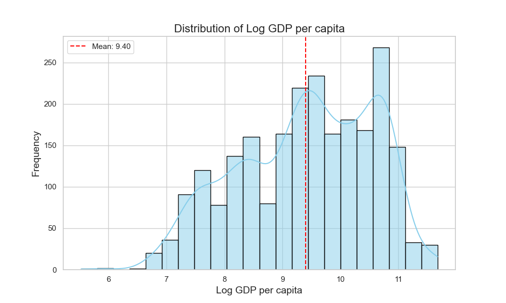

The provided dataset captures various socio-economic indicators, subjective well-being measures (the "Life Ladder"), and other dimensions across countries over the years 2005 to 2023. Below is an analysis of the key findings derived from the summary statistics, missing values, correlations, and outliers present in the data.

### Summary Statistics

1. **Geographical Distribution**:
   - There are 2363 entries across 165 unique countries, with Lebanon being the most frequently represented country (18 times). This suggests a dense representation of certain countries relative to others in the dataset.

2. **Temporal Distribution**:
   - The mean year is approximately 2014.76, and the dataset captures data from a minimum year of 2005 to a maximum of 2023. This allows for a temporal analysis of trends over nearly two decades.

3. **Life Ladder**:
   - The average Life Ladder score is 5.48, with a standard deviation of 1.13, indicating variations in perceived well-being across countries. The range spans from a low of 1.281 to a high of 8.019, showing significant disparities in happiness or life satisfaction.

4. **Economic Dynamics**:
   - The average log GDP per capita is 9.40 (approx. $12,000), with many outlier values at the higher end (max 11.676, approx. $116,100). The correlation between Log GDP per capita and Life Ladder is notably strong (0.78), suggesting a strong relationship between economic prosperity and subjective well-being.

5. **Social Indicators**:
   - The average Social Support score is 0.81, showing a generally high perception of social connectivity. However, there are instances of low social support indicated by the minimum value of 0.228.
   - Healthy life expectancy averages at approximately 63.4 years, revealing systemic health disparities, especially across poorer nations.

6. **Perceptions of Corruption and Freedom**:
   - The average perception of corruption is 0.74, with a notable negative correlation (-0.43) with the Life Ladder. This suggests that higher corruption is associated with lower perceived quality of life.
   - Freedom to make life choices has an average score of 0.75, which is positively correlated with the Life Ladder (0.54), hinting that people feel happier when they have more autonomy in their lives.

7. **Generosity and Affects**:
   - Generosity appears low overall with a mean close to 0, and significant missing values (81 entries). Its positive correlation with perceptions of happiness (0.18) indicates that more generous societies might contribute slightly to feelings of satisfaction.
   - Positive affect averages at 0.65, while negative affect shows a mean of 0.27, showing a higher prevalence of positive emotional experiences relative to negative ones.

### Missing Values

- The analysis reveals missing values across most columns, with Healthy Life Expectancy having the highest missing entries (63). This can skew results if these entries are not handled appropriately.
- The missing data underscores the importance of identifying which countries or regions have comprehensive data available and which do not, possibly due to poor data collection systems or socio-political instability.

### Correlation Analysis

1. **Key Correlations**:
   - The strongest correlation is between Log GDP per capita and Life Ladder (0.78). This emphasizes the link that greater economic resources often translate into improved quality of life and happiness.
   - Freedom to make life choices has a strong positive correlation with subject wellbeing (0.54).
   - Negative affect negatively correlates with Life Ladder (-0.35), highlighting the role of emotional wellness in perceived life satisfaction.

2. **Correlations with Corruption**:
   - Perceptions of corruption show a strong negative correlation with both Life Ladder (-0.43) and social support (-0.22), indicating societies with low trust in governance struggle with overall life satisfaction.

### Outlier Analysis

1. Certain countries exhibit extreme values, both high and low in several indicators (e.g., an extremely high Log GDP per capita compared to general averages). These outliers suggest that some nations might display unique economic characteristics or social phenomena, warranting further investigation.

### Implications

1. **Societal Improvements**:
   - Enhancing social support, reducing corruption, and improving health standards can lead to increases in well-being across countries. 
   - Policymakers should focus on creating environments where citizens feel they have control over their choices to enhance happiness levels.

2. **Data Completeness and Integrity**:
   - Addressing missing data gaps, particularly in healthcare and economic variables, can improve the reliability and robustness of future analyses.
   - Initiatives to improve data collection in underrepresented countries could yield better insights into global well-being trends.

3. **Target for Development Policies**:
   - Countries with low Life Ladder scores could benefit from targeted development programs focusing on economic growth, social support structures, and healthcare access to boost overall happiness.

Overall, the dataset serves as a valuable resource for understanding the interplay between economic, social, and emotional well-being on a global scale and highlights critical areas for intervention to improve life satisfaction across different populations.

### Visualizations:

