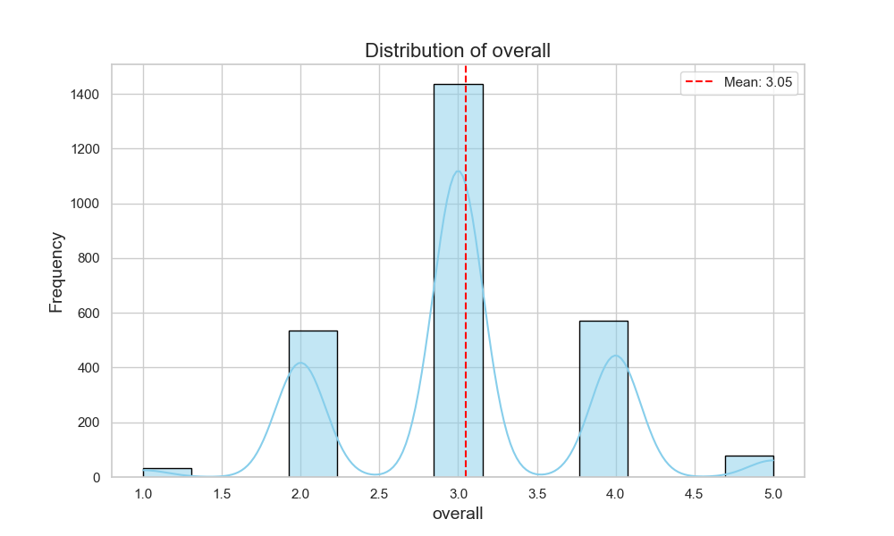
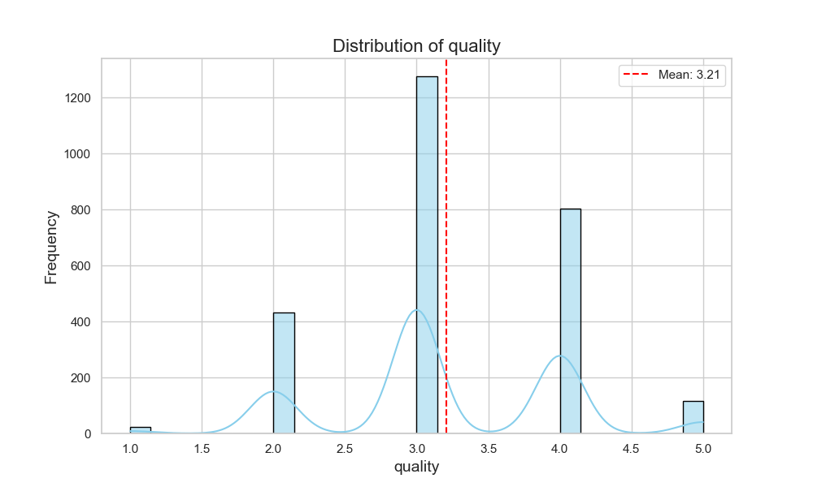
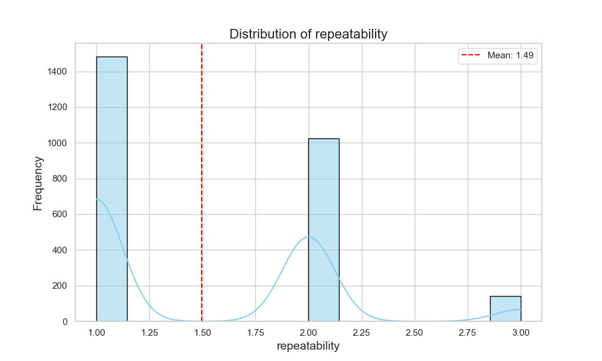

Based on the provided data summary, missing values, correlations, and outliers, here's an analysis highlighting significant findings and their implications:

### Key Findings:

1. **Date Insights**:
   - The dataset contains 2,553 entries with 2,055 unique dates, indicating multiple entries for certain dates (the most frequent being '21-May-06' with 8 occurrences).
   - There are 99 missing date values, which could impact the volume of lapsed entries since time-based analysis might be limited.

2. **Language**:
   - The data is predominantly in English (1,306 entries), making up nearly 49% of the dataset. This could influence the audience reach and market targeting. The presence of 11 unique languages suggests a diverse set of entries, yet only a small fraction are heavily represented.
   
3. **Type Distribution**:
   - The majority of entries are classified as "movies" (2,211 entries), which underscores a heavy focus on this format. This could narrate trends in content creation and audience entertainment preferences.

4. **Titles**:
   - With 2,312 unique titles, there's a rich diversity in content, although the most represented title ('Kanda Naal Mudhal') appears frequently (9 times). This could indicate its popularity or multiple releases.

5. **Author/Creator Analysis ("by")**:
   - The most frequently mentioned creator is Kiefer Sutherland with 48 occurrences. This suggests a potential market or fan interest that might be leveraged for future releases or marketing efforts. However, there are 262 missing values, which indicates a lack of authorship credit in many entries.

6. **Overall Ratings**:
   - The average overall rating is approximately 3.05 (on a scale that seems to go up to 5), with a standard deviation of 0.76, indicating moderate satisfaction among users or viewers.
   - The `quality` metric has a higher mean rating of around 3.21, with instances of both 1s and 5s indicating polarized feedback on content quality.

7. **Repeatability of Ratings**:
   - The average repeatability score is approximately 1.49, which suggests that the ratings tend to be consistent but also may indicate variation in how often users rate certain content. A significant majority rated only once (median at 1), with a maximum of 3.

### Correlations:
- The correlation between `overall` and `quality` ratings is quite high (0.826), indicating that higher quality ratings likely lead to higher overall ratings. This is significant for enhancing quality as a focus to improve audience satisfaction.
- The correlation between `overall` ratings and `repeatability` at 0.513 is positive yet moderately strong, implying that consistent reviewers tend to give similar ratings, suggesting reliability in their assessments.
- The lower correlation (0.312) between `quality` and `repeatability` signals that while quality is appreciated, it does not significantly drive repeated ratings from the same users.

### Outliers:
- Both `overall` and `quality` metrics reveal numerous outliers (primarily high scores of 5 and low scores of 1). This suggests a divided user base, which presents marketing and quality assurance challenges; some viewers may love or strongly dislike the content.
- The absence of outliers for repeatability implies that ratings typically fall into a narrow band without extreme variances.

### Implications:
- **Content Strategy**: The dominance of movie content and a specific creator can guide marketing decisions, such as promoting similar genres or creators that resonate with user preferences.
- **Quality Improvements**: Given the strong correlation between quality and overall rating, continual enhancement of quality could significantly increase overall audience satisfaction.
- **Data Completeness**: The significant numbers of missing values—especially in the date and author sections—indicate a need for improved data collection methods to ensure comprehensive analytics.
- **Diverse Audience Engagement**: With multiple languages represented, targeted campaigns can be devised to cater to different language speakers, thereby increasing engagement and market penetration.

In conclusion, the dataset presents insights that can be utilized to refine content strategy, understand audience preferences better, and prioritize efforts towards improving quality and completeness in records. The approach can help sustain engagement and increase satisfaction among viewers, potentially driving content growth and loyalty.

### Visualizations:

